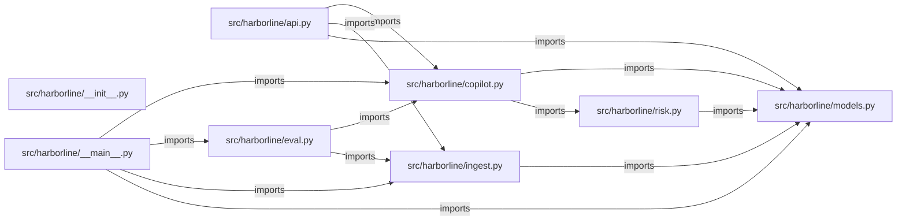

# fde-harborline-engagement — project architecture

[README](README.md) · [Interview questions and answers](INTERVIEW_QA.md)

## Purpose and scope

Simulated forward deployed engagement for Harborline Freight, a regional carrier with about 400 trucks. Dispatch was losing half an hour on every late shipment because the answer lived in three places: a nightly TMS export, a ticket queue, and a binder of SOPs. The security rule that shaped the build: shipment data does not leave their environment, and the service makes no call to an external model.

This document describes files and symbols in this checkout. Deployment templates and statements in the original overview are distinguished from a verified running environment.

## Component diagram



For Python repositories, arrows show resolved local imports, not network calls or deployment order. Otherwise the diagram is a repository component map; containment arrows do not assert runtime integration.

## Components and responsibilities

| Component | Responsibility |
| --- | --- |
| [`src/harborline/api.py`](src/harborline/api.py) | HTTP handlers: `GET /health`, `GET /shipments/{shipment_id}`, `POST /ask`, `GET /audit` |
| [`src/harborline/risk.py`](src/harborline/risk.py) | Functions: `score_shipment` |
| [`src/harborline/eval.py`](src/harborline/eval.py) | Functions: `run` |
| [`src/harborline/copilot.py`](src/harborline/copilot.py) | Functions: `select_sop`, `answer_question` |
| [`src/harborline/models.py`](src/harborline/models.py) | Functions: `shipment`, `tickets_for`, `sop`, `render` |
| [`src/harborline/ingest.py`](src/harborline/ingest.py) | Functions: `load_store`, `_load_shipments`, `_load_tickets`, `_load_sops` |
| [`requirements.txt`](requirements.txt) | Implementation or supporting configuration |
| [`src/harborline/__init__.py`](src/harborline/__init__.py) | Implementation or supporting configuration |
| [`src/harborline/__main__.py`](src/harborline/__main__.py) | Functions: `main` |
| [`Dockerfile`](Dockerfile) | Container build/service configuration |
| [`tests/test_api.py`](tests/test_api.py) | Executable checks and regression examples |
| [`tests/test_copilot.py`](tests/test_copilot.py) | Executable checks and regression examples |
| [`tests/test_eval.py`](tests/test_eval.py) | Executable checks and regression examples |
| [`.github/workflows/ci.yml`](.github/workflows/ci.yml) | GitHub Actions job definitions |
| [`README.md`](README.md) | Project explanations or operating notes |
| [`data/sops/checkpoint-delay.md`](data/sops/checkpoint-delay.md) | Project explanations or operating notes |
| [`data/sops/cold-chain-exception.md`](data/sops/cold-chain-exception.md) | Project explanations or operating notes |

## Existing design and operating guides

These checked-in guides provide the project’s detailed design, operational context, or deployment view:

- [`docs/01-discovery-brief.md`](docs/01-discovery-brief.md).
- [`docs/03-solution-design.md`](docs/03-solution-design.md).
- [`docs/04-security-and-data.md`](docs/04-security-and-data.md).
- [`docs/05-rollout-plan.md`](docs/05-rollout-plan.md).

## Request interface

| Method and path | Handler | Source |
| --- | --- | --- |
| `GET /health` | `health` | [`src/harborline/api.py`](src/harborline/api.py#L23) |
| `GET /shipments/{shipment_id}` | `get_shipment` | [`src/harborline/api.py`](src/harborline/api.py#L28) |
| `POST /ask` | `ask` | [`src/harborline/api.py`](src/harborline/api.py#L43) |
| `GET /audit` | `audit` | [`src/harborline/api.py`](src/harborline/api.py#L72) |

The table lists literal route decorators found in the inspected Python modules. Router prefixes and middleware can add behavior; check the linked handler and application setup before calling an endpoint.

## Implementation walkthrough

### `score_shipment(shipment: Shipment, tickets: list[Ticket])`

Source: [`src/harborline/risk.py`](src/harborline/risk.py#L9).

Score one shipment with the policy Harborline's dispatch lead signed off.

Delivered shipments are out of the queue. Closed tickets do not add risk.
Points are capped so one signal cannot hide the others in the readout.

Calls visible in this function: `', '.join`, `Risk`, `min`, `reasons.append`, `shipment.last_event.lower`, `tuple`.

```python
def score_shipment(shipment: Shipment, tickets: list[Ticket]) -> Risk:
    """Score one shipment with the policy Harborline's dispatch lead signed off.

    Delivered shipments are out of the queue. Closed tickets do not add risk.
    Points are capped so one signal cannot hide the others in the readout.
    """
    score = 0
    reasons: list[str] = []
    open_tickets = tuple(ticket for ticket in tickets if ticket.status == "open")

    overdue = shipment.hours_since_checkpoint - shipment.checkpoint_sla_hours
    if shipment.status != "delivered" and overdue > 0:
        points = min(40, 10 + overdue * 2)
        score += points
        reasons.append(
            f"Checkpoint is {overdue}h past the {shipment.checkpoint_sla_hours}h SLA (+{points})"
        )

    if shipment.status == "exception":
        score += 25
        reasons.append("TMS status is exception (+25)")

```

The excerpt is truncated; the linked source contains the full implementation.

### `run(path: Path | None=None)`

Source: [`src/harborline/eval.py`](src/harborline/eval.py#L10).

Calls visible in this function: `(path or EVALS_PATH).read_text`, `(path or EVALS_PATH).read_text().splitlines`, `answer_question`, `any`, `failures.append`, `json.loads`, `len`, `line.strip`, `load_store`, `print`.

```python
def run(path: Path | None = None) -> int:
    store = load_store()
    failures: list[str] = []
    cases = 0
    for line in (path or EVALS_PATH).read_text().splitlines():
        if not line.strip():
            continue
        cases += 1
        case = json.loads(line)
        answer = answer_question(store, case["shipment_id"], case["question"])
        if answer.band != case["expected_band"]:
            failures.append(
                f"{case['shipment_id']}: band {answer.band}, expected {case['expected_band']}"
            )
        expected_citation = case["expected_citation"]
        if expected_citation not in answer.citations and not any(
            expected_citation in citation for citation in answer.citations
        ):
            failures.append(f"{case['shipment_id']}: missing citation {expected_citation}")
        if not answer.steps:
            failures.append(f"{case['shipment_id']}: answer has no SOP steps")
    if failures:
```

The excerpt is truncated; the linked source contains the full implementation.

### `answer_question(store: Store, shipment_id: str, question: str)`

Source: [`src/harborline/copilot.py`](src/harborline/copilot.py#L25).

Calls visible in this function: `Answer`, `ValueError`, `citations.append`, `citations.extend`, `question.strip`, `score_shipment`, `select_sop`, `store.shipment`, `store.sop`, `store.tickets_for`, `tuple`.

```python
def answer_question(store: Store, shipment_id: str, question: str) -> Answer:
    if not question.strip():
        raise ValueError("question is required")
    shipment = store.shipment(shipment_id)
    risk = score_shipment(shipment, store.tickets_for(shipment_id))
    sop = store.sop(select_sop(shipment, question))
    citations = [f"data/shipments.csv#{shipment.shipment_id}"]
    citations.extend(f"data/tickets.csv#{ticket.ticket_id}" for ticket in risk.open_tickets)
    citations.append(f"{sop.path}#{sop.title}")
    return Answer(
        shipment_id=shipment.shipment_id,
        customer=shipment.customer,
        lane=shipment.lane,
        checkpoint=shipment.checkpoint,
        hours_since_checkpoint=shipment.hours_since_checkpoint,
        checkpoint_sla_hours=shipment.checkpoint_sla_hours,
        score=risk.score,
        band=risk.band,
        reasons=risk.reasons,
        sop_title=sop.title,
        steps=sop.steps[:3],
        citations=tuple(citations),
```

The excerpt is truncated; the linked source contains the full implementation.

### `select_sop(shipment: Shipment, question: str)`

Source: [`src/harborline/copilot.py`](src/harborline/copilot.py#L11).

Pick the playbook with the rule the dispatch lead approved.

A ranked search was rejected in discovery because the night desk could not
explain why one SOP won. Medical cargo outranks a temperature event.

Calls visible in this function: `question.lower`, `shipment.customer.lower`, `shipment.last_event.lower`.

```python
def select_sop(shipment: Shipment, question: str) -> str:
    """Pick the playbook with the rule the dispatch lead approved.

    A ranked search was rejected in discovery because the night desk could not
    explain why one SOP won. Medical cargo outranks a temperature event.
    """
    question_text = question.lower()
    if "medical" in shipment.customer.lower() or "medical" in question_text:
        return MEDICAL
    if shipment.cargo_type == "reefer" and "temp" in shipment.last_event.lower():
        return COLD_CHAIN
    return CHECKPOINT
```

## Validation and failure paths

| Explicit exception | Source |
| --- | --- |
| `SystemExit(main())` | [`src/harborline/__main__.py`](src/harborline/__main__.py#L30) |
| `HTTPException(status_code=404, detail=f'Unknown shipment {shipment_id}')` | [`src/harborline/api.py`](src/harborline/api.py#L32) |
| `HTTPException(status_code=404, detail=f'Unknown shipment {body.shipment_id}')` | [`src/harborline/api.py`](src/harborline/api.py#L47) |
| `HTTPException(status_code=400, detail=str(exc))` | [`src/harborline/api.py`](src/harborline/api.py#L49) |
| `ValueError('question is required')` | [`src/harborline/copilot.py`](src/harborline/copilot.py#L27) |
| `ValueError(f'{path} needs a heading and numbered steps')` | [`src/harborline/ingest.py`](src/harborline/ingest.py#L71) |
| `KeyError(title)` | [`src/harborline/models.py`](src/harborline/models.py#L58) |
| `ShipmentNotFound(shipment_id)` | [`src/harborline/models.py`](src/harborline/models.py#L49) |

These are explicit exceptions in the inspected source, rather than a claim that every failure is handled. Follow the calling handler to see whether the exception becomes an HTTP response or propagates.

## Data and state

- [`src/harborline/api.py`](src/harborline/api.py) defines module-level containers: `audit_log`.

Module-level dictionaries/lists live in a Python process. They can be fixtures or mutable state; inspect writes before treating them as persistent storage. A production extension would need to define persistence and concurrency behavior explicitly.

## Data flow and design decisions

### What is the input-to-output contract of `score_shipment`

In [`src/harborline/risk.py`](src/harborline/risk.py#L9), `score_shipment(shipment: Shipment, tickets: list[Ticket])` receives the inputs. The function computes these intermediate values:

- `score = 0`
- `reasons: list[str] = []`
- `open_tickets = tuple((ticket for ticket in tickets if ticket.status == 'open'))`
- `overdue = shipment.hours_since_checkpoint - shipment.checkpoint_sla_hours`
- `p1 = [ticket for ticket in open_tickets if ticket.priority == 'P1']`
- `score = min(score, 100)`

Its result is defined by:

- `Risk(score=score, band=band, reasons=tuple(reasons), open_tickets=open_tickets)`

### Which decision rules or boundary conditions should an interviewer challenge

The implementation in [`src/harborline/risk.py`](src/harborline/risk.py#L9) branches on:

- `shipment.status != 'delivered' and overdue > 0`
- `shipment.status == 'exception'`
- `p1`
- `shipment.cargo_type == 'reefer' and 'temp' in shipment.last_event.lower()`
- `score >= HIGH_BAND`
- `open_tickets`
- `score >= MEDIUM_BAND`

A useful extension is a table-driven test that covers each condition just below, at, and above its boundary where applicable. These expressions are the current rules; changing them changes behavior and should be justified by the project’s acceptance criteria.

## Setup and verification

The following commands are derived from the checked-in dependency/test contracts. Execute them from the repository root; the block prepares a local environment, not a cloud deployment.

```bash
python3 -m venv .venv
source .venv/bin/activate
python -m pip install -r requirements.txt
python -m pytest -q
```

Python dependencies: [`requirements.txt`](requirements.txt).

Test entry points: [`tests/test_api.py`](tests/test_api.py), [`tests/test_copilot.py`](tests/test_copilot.py), [`tests/test_eval.py`](tests/test_eval.py).

Automation definitions: [`.github/workflows/ci.yml`](.github/workflows/ci.yml). Read their triggers and job steps to determine what CI actually runs.

## Operating boundaries and design review

Before turning this checkout into a customer deployment, establish the input contract, data ownership, access controls, failure response, evaluation criteria, and rollback owner. Repository fixtures and unit tests demonstrate local behavior; they do not establish throughput, uptime, compliance, or business impact.

A useful architecture review starts with the linked implementation: identify where input enters, where a decision is made, which state can change, and which external dependency can fail. Add a deployment view only for infrastructure that is actually configured and exercised.
